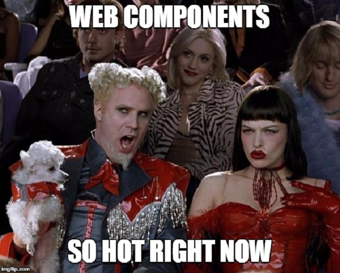

This past week I had the opportunity to work on my first project using [Evan You](https://twitter.com/youyuxi)’s awesome creation. [Vue.js](http://vuejs.org/), is a reactive component based [MVVM](https://en.wikipedia.org/wiki/Model%E2%80%93view%E2%80%93viewmodel) JavaScript library for modern web interfaces. Wait, what? In plain English Vue.js is a small library that makes it [painless to create interactive user interfaces](http://blog.evanyou.me/2015/10/25/vuejs-re-introduction/) without worrying about all of the manual DOM manipulation and event listening. In spirit React comes close to what Vue.js is trying to achieve, build component based web user-interfaces. Letting you create the components and the data-flow and taking care of all the data-binding and DOM updates, this is what Vue calles “Reactivity”.

## # 1 Easy to get started

What really drew me to Vue.js is how easy it is to get started, just [drop in the Vue.js library](http://vuejs.org/guide/installation.html) before your closing `</body>` tag and you are ready to go. There is no need to setup Gulp, Grunt or Webpack tasks to transpire JSX templates. There is no need in learning a new JavaScript variant like TypeScript. Everything just works by dropping a single JS library, this is how it used to be during the good-ol jQuery days **shakes cane**. But jokes aside, this simplicity is not a limiting–factor for bigger projects, you should still use good tooling, more on that later. This is, ladies and gentlemen, is how you counter [JavaScript tooling fatigue](https://medium.com/@ericclemmons/javascript-fatigue-48d4011b6fc4#.8nsprbdmw) in 2016.

Approachability is not only on the surface of Vue.js, the design of the [API](http://vuejs.org/api/) that it provides is very logical and simple. I was constantly surprised at how much functionality I was able to build in very little code. Vue.js uses plain JavaScript objects that it extends with additional properties, it just makes sense. It turns out that if you take out all of the DOM and event manipulation from your code what is left is your business logic.

## # 2 Component Based

At the core of Vue.js are components, small self-contained pieces of code that can be reused to build a large-scale application. I know, I know components are so hot right now. The way that [Vue’s components](http://vuejs.org/guide/overview.html#Component-System) are defined and used are modelled after the W3C Custom Elements spec, which is part of the new [Web Components Spec](https://www.w3.org/wiki/WebComponents/). This means that using Vue.js and it’s component will be similar to native browser functionality in the future. In reality you get to define your components as custom HTML tags that Vue renders and into full-featured components. I think it fits remarkably well with the HTML markup paradigm. Making it easy to reason about the position and composition of the components in your application.

A slightly more advanced feature but no less awesome feature of Vue.js components are [Single File Components](http://vuejs.org/guide/application.html#Single-File-Components), using tools like Vueify allow you to define the template, logic and styling of your component in a single file. No more context switching and jumping to different files to make a change to the style of your component. This feature reminds me of the work on the HTML Shadow DOM.

## # 3 Solves the right problem

On a theoretical level I feel that Vue.js solves the right problem for me, it does not replace your entire page with a SPA. You can use Vue as needed, on small sections of your site. This makes sense to me for the kind of projects I work on.

`<hand-wavy-statement>` *Let’s face it, most front-end developers are not working on Google or Facebook scale applications that require hundreds if not thousands of engineers to collaborate safely on.*`</hand-wavy-statment>`

Vue.js does not force you into complex setup to define your app’s architecture and data-store. It allows you to just get started fast and add the features that you need as you need them.

## # 4 Good Resources

The way I learn new technology is usually by watching videos, reading a book on the subject and trying out some small projects. At first with Vue, I stated with Jeffrey Way’s screencasts on [Laracast](https://laracasts.com/series/learning-vue-step-by-step), which offer a great introduction to Vue. Then I dove staring into a project.

<blockquote class="twitter-tweet">
Sometimes the best tactic to get something done is to read the docs <a href="https://twitter.com/hashtag/awesomedocumentation?src=hash&amp;ref_src=twsrc%5Etfw">#awesomedocumentation</a> <a href="https://twitter.com/hashtag/vuejs?src=hash&amp;ref_src=twsrc%5Etfw">#vuejs</a>
&mdash; Vadim Brodsky (@VadimBrodsky) <a href="https://twitter.com/VadimBrodsky/status/768802734996873216?ref_src=twsrc%5Etfw">August 25, 2016</a></blockquote>

In the beginning a little lost and slow, but then looking at the [official Vue.js guide](http://vuejs.org/guide/) and documentation everything became very clear. Vue has very good documentation that makes it a breeze to understating how to use Vue.

Another important aspect of Vue.js development are the error messages, if you use the non-minified source code of the Vue library you will get nice descriptive error messages in your console.

More resources can be found on the [awesome-vue](https://github.com/vuejs/awesome-vue) repository.

## #5 Awesome tooling

Tool fatigue is a real thing in the JavaScript ecosystem, but to be more productive you need tools to get the job done. To my surprise Vue.js has a complete set of useful tools that will help you. It’s almost astonishing how much is already created by Evan and a small group of developer without corporate backing.

Some of the tools that caught my attention are [vue-cli](https://github.com/vuejs/vue-cli) for quick scaffolding, [vue-router](https://github.com/vuejs/vue-router), [vue-resource](https://github.com/vuejs/vue-resource) for making HTTP and Ajax requsts, [vue-validator](https://github.com/vuejs/vue-validator) for data validation, [vuex](https://github.com/vuejs/vuex) for flux-inspired architecture.

But the tool I am using the most in my day to day development with Vue is the [vue-devtools](https://github.com/vuejs/vue-devtools). A Chrome extension that allows to inspect and interact Vue components, and it’s also written in Vue.

## # 6 Minimal Overhead

In light of the recent [Leftpad debacle](http://www.theregister.co.uk/2016/03/23/npm_left_pad_chaos/), I was wary of un-needed dependencies in my projects. Vue.js does not disappoint in this department, it is designed to be light and had no third-party dependencies, wow! This is a clear win for Vue and this is what allows Vue to be improved bettering performance and keeping the API stable.

In addition Vue plays nicely without other libraries, need to bring in jQuery and Bootstrap. No problem Vue.js plays nicely with them, making the integration a breeze.

## Future Facing

One of the biggest counterpoints I can see against Vue.js is the size of the team devoted to it. It does not have Facebook’s or Google’s coffers at it’s disposal to fund Evan’s time. And hey he is a guy, so the [bus factor](https://en.wikipedia.org/wiki/Bus_factor) does not work in Vue’s favour. But Evan is taking stability very seriously, the Vue.js [community is growing](http://blog.evanyou.me/2015/12/20/vuejs-2015-in-review/) and the [Patron Campaign](https://medium.com/the-vue-point/the-state-of-vue-1655e10a340a#.oukvd6nrt) is going strong.

There are many good things on the [horizon for Vue](https://medium.com/the-vue-point/announcing-vue-js-2-0-8af1bde7ab9#.7x1xc4vev), the new release Vue 2.0 is now in RC sate and it offers many performance improvement with an implementation of a Virtual DOM. This change ought to bring up to a 4X performance improvement for Vue.

Anyhow, don’t take my word for it, go [play around with Vue.js](http://vuejs.org/) to form your own opinion, let me know what you think.
